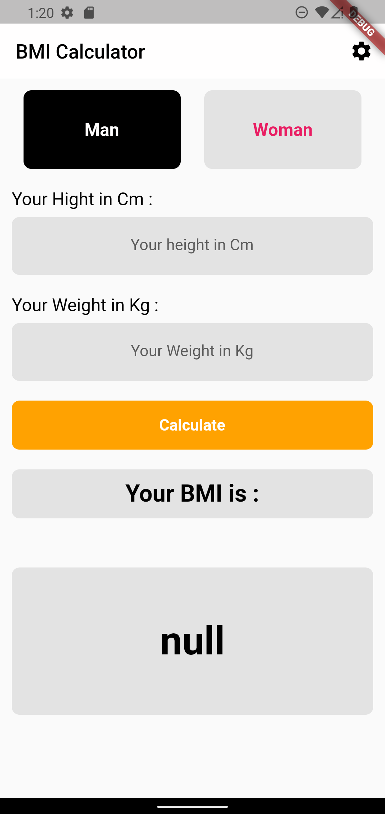

# bmi_calculator

Flutter project !!.

### _การทำงานของแอปพลิเคชัน_ 

       - BMI Calculator - เป็น app ที่ช่วยให้ผู้ใช้สามารถคำนวณดัชนีมวลกาย ในการวัดขึ้นอยู่กับน้ำหนักและความสูงที่ผู้ใช้ 
       - BMI - ดัชนีมวลกาย (BMI) คำนวณไขมันในร่างกายของคุณตามน้ำหนักและความสูงของคุณ

### _รูปลักษณ์ภายในแอปพลิเคชัน_

